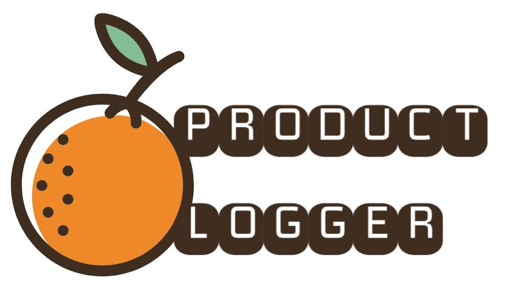

<h2 align="center">
  
  
  
  
</h2>
<h1 align="center">
    
</h1>

## 🔎 Sobre o projeto

Product Logger é uma plataforma para o cadastro de ferramentas e serviços baseado no Product, ligando quem quer ajudar aqueles que presisam ser ajudados.

Parte desse projeto foi desenvolvido na Next Level Week 3.

🚧 Em construção... 🚧

## Features ##

- [x] Cadastro de orfanatos
- [x] Listagem de orfanatos em mapa
- [x] Cadastro de usuários
- [x] Login de usuários
- [x] Retrição de áreas à usuários não autenticados ultilizando token de autenticação
- [x] Recuperação de senhas via email
- [x] Dash board de usuário
- [x] Dash board de administrador
- [x] Verificação de permissoes de administrador ao fazer requisições
- [x] Exclusão de orfanatos
- [x] Edição de orfanatos
- [x] Verificação de permissões do usuário para com orfanato
- [x] Orfanatos cadastrados tem que pssar por validação de administrador
- [ ] Cadastro e contado por whatsapp
 
