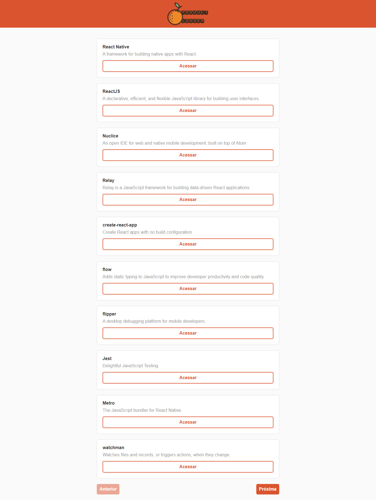

<h2 align="center">
  
  
  
  
</h2>
<h1 align="center">
    
</h1>

## 🔎 Sobre o projeto

Product Logger é uma aplicação que ajuda na catalogação, compatilhamento e disseminação de novas ferramentas e serviços.

Product Logger é baseado no ProductHunt.

🚧 Em construção... 🚧

## Features ##
- Server
  - [x] Cadastro de 'produtos'
  - [x] Adição de sistema de tags
  - [x] Listagem de 'produtos'
  - [x] Adição de paginação à Listagem de 'produtos'
  - [x] Cadastro de usuários
  - [x] Encriptação de senhas
  - [x] Login de usuários
  - [X] Cadastro de administrador
  - [x] Verificação de permissoes de administrador ao fazer requisições
  - [x] Exclusão de 'produtos'
  - [x] Edição de 'produtos'
  - [x] Verificação de permissões do usuário para com 'produto'
  - [ ] Retrição de áreas à usuários não autenticados ultilizando token de autenticação
  - [ ] Recuperação de senhas via email
 - Web
  - [ ] Cadastro de 'produtos'
  - [x] Listagem de 'produtos'
  - [x] Adição de paginação à listagem de 'produtos'
  - [ ] Página de cadastro de usuários
  - [ ] Login de usuários
  - [ ] Cadastro de administradores
  - [ ] Página de exclusão de 'produtos'
  - [ ] Página de edição de 'produtos'
  - [ ] Restrição de áreas à usuários não autenticados ultilizando token de autenticação
  - [ ] Pagina de recuperação de senhas via email
 - Mobile
  - [ ] Cadastro de 'produtos'
  - [x] Página de listagem de 'produtos'
  - [x] Adição de paginação à listagem de 'produtos'
  - [ ] Página de cadadastro de usuários
  - [ ] Login de usuários
  - [ ] Cadastro de administradores
  - [ ] Página de exclusão de 'produtos'
  - [ ] Página de edição de 'produtos'
  - [ ] Restrição de áreas à usuários não autenticados ultilizando token de autenticação
  - [ ] Pagina de recuperação de senhas via email
  
  
&nbsp;

## 🛠 Tecnologias e sua aplicação no projeto
- [javascript](https://www.typescriptlang.org/) é uma linguagem de programação interpretada estruturada

- **back-end**
  - [nodeJs](https://nodejs.org/en/) é um ambiente de execução Javascript server-side, usado para a construção do código
  - [cors](https://www.npmjs.com/package/cors) é um middleware para o express, usado para a limitação do acesso a API do back-end
  - [express](https://expressjs.com/pt-br/) é uma framework para aplicativos web js, varios de seus recursos foram usados
  - [multer](https://www.npmjs.com/package/multer) é um middleware para lidar com multipart/form-data, usado para o upload de arquivos no servidor
  - [sequelize](https://typeorm.io/#/) é uma Object Relational Mapper, usado na integração com o banco de dados, relacionando os dados aos objetos que os representam 
 
- **Front-end Web**
  - [react](https://reactjs.org/) é uma biblioteca de criação de interfaces, usado na criação de todas as interfaçes da aplicação 
  - [axios](https://www.npmjs.com/package/axios) é um cliente HTTP baseado em promisses, usado na conexão
  
- **Front-end Mobile**
  - [react-native](https://reactnative.dev/) é uma framework para desenvolvimento mobile
  - [expo](https://expo.io/) é uma plataforma que auxilia o desenvolvimento com react-native
  

&nbsp;

## 🚀 Demonstração

<b>Página de listagem</b>

  

&nbsp;

---

## Sobre mim

Feito com ❤️ por Evailson Barbosa 👋🏽 Entre em contato!

 

